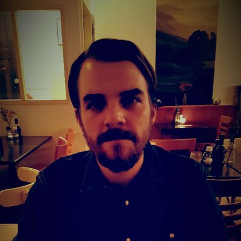

## Linguistic temporal trajectory analysis

This is the companion website for the "Linguistic temporal trajectory analysis" workshop that we teach at the [2018 European Symposium Series on Societal Challenges
in Computational Social Science](http://symposium.computationalsocialscience.eu/2018/). The workshop will provide participants with an overview of techniques and existing works related to linguistic temporal trajectory analysis in R.

We welcome students and researchers from all disciplines working with text data that are interested in applying computational concepts in the social sciences (e.g., Psychology, Criminology, Computer Science, Linguistics, Digital Humanities, Political Science, etc.).

_(this website will be updated in the weeks leading to the workshop)_

### What is it?

This workshop focuses on the quantitative analysis of text data using the concept of *linguistic temporal trajectory analysis (LTTA)*. LTTA aims to study how the use of language develops over time by continuously analysing semantic properties of temporal representations of language. Specifically, the temporal development can be studied (i) on the forum-level (i.e., how does the language used on whole platforms or sub-forums change over time?), (ii) on the user-level (i.e., how do individual users change their language over time?), and (iii) on the intra-textual level (i.e., how do text properties change as a function of narrative progression?). In doing so, LTTA combines computational linguistics with statistical modeling (e.g., time series analysis) to provide a new base for understanding social and behavioral phenomena in text data. 

LTTA's continuous and dynamic approach to studying linguistic data can help shed light on dynamic processes in linguistic data that are not captured by static approaches. LTTA is particularly promising for research areas where relevant constructs might be hidden (e.g., hidden advertisement in YouTube vlogs and detecting embedded deception in statements), or where forecasting models could help mitigate or prevent phase transitions (e.g., in the development of radical language).

We will outline the idea behind LTTA, how to implement it in R, and discuss the assumptions and limitaions of the method.

### Preliminary schedule of the workshop

Note: this workshop consists of one **WORKSHOP + TUTORIAL** part (in the morning) and a **PAPER HACKATHON** (after the lunch break).

The preliminary workshop schedule is as follows:

| WORKSHOP + TUTORIAL | (morning) |
| :--------------------------------------- | :---------------- |
| Introduction to linguistic temporal trajectory analysis | 09:00 - 09:45     |
| Rationale, the aim of the method, differences to existing approaches (e.g., simple sentiment analysis), levels of analysis  (trajectory of language use over time vs. dynamic intratextual linguistic analysis),  extensions: unsupervised (non-)hierarchical clustering of temporal patterns, supervised machine learning with temporal patterns, breakpoint estimation of non-stationary linguistic time series data. | Mini-lectures      |
| **Examples of linguistic temporal trajectory analysis** | **10:00 - 10:30** |
| Linguistic trajectories of far-right extremists,  intratextual sentiment analysis of narrative styles of YouTube vloggers, narrative trajectories in TED talks, emotional arcs of stories,  Intratextual sentiment analysis of lone-actor terrorists’ manifestos | Case-studies      |
| **Linguistic trajectory analysis in R**  | **11:00 - 12:30** |
| Running LTTA on simple simulated data (using a plenary walk-through code example),  using LTTA on real data reproducing the analysis of our "narrative styles of YouTube vlogs" paper (individually or in teams under the guidance of the organizers) | Tutorial          |
|   |  |
| LUNCH BREAK  | 12:30 - 13:30 |
|   |  |
| **PAPER HACKATHON** | **(afternoon)** |

#### Paper hackathon

Dataset provided uniquely for this session:

-	transcripts of all vlogs uploaded to YouTube by specific YouTubers.
-	Columns: vlogger ID, vlog transcript, vlog view count, vlog posting date.
-	Each row represents one vlog.
-	Features (extracted before due to time constraints for large datasets): part-of-speech tags, named entities, psycholinguistic variables (e.g., from the LIWC), valence-shifter sensitive sentiment

Research question: How does the language of YouTube's vloggers evolve?

Possible sub-questions:

-	Do YouTubers adapt their language style to the view count?
-	Is there a common trajectory of successful vloggers?
-	Does the linguistic trajectory evolution differ between gender/regions/target audience?

Format:

-	All workshop participants are provided with the dataset (GitHub repo and readme)
-	All participants have access to a shared Google Document for the paper
-	Participants and organizers brainstorm possible approaches
-	Work on the paper (e.g., distributed into introduction, dataset description, method, results, discussion)
-	All participants are co-authors of the paper (to be determined at random) with a detailed appendix on author contributions.
-	The workshop ends with a (nearly) ready draft of the paper which is posted on arXiv in its final form and jointly submitted to the _Journal of Computational Social Science_.

### Prerequisites

Participants should have some basic knowledge of the _R_ or _python_ programming language. The workshop will focus on R but the transition from python is relatively straightforward (esp. with pandas).

### Organisers

|         |        |          |
| :--------------------------------------: | :--------------------------------------: | :-----------------------------------: |
| [Bennett Kleinberg](https://bkleinberg.net) | [Isabelle van der Vegt](https://twitter.com/Isabellevdv) | [Maximilian Mozes](http://mmozes.net) |
| Assistant Professor in Data Science (University College London)  | PhD student (University College London) | MSc student (Technical University of Munich) |

-----

## Materials

### Workshop + Tutorials

#### Background literature

- paper 1
- paper 2
- paper 3

#### Code

(the code for all examples in the tutorials will be available [here](./code))

#### Slides

(slides will be available [here](./slides))

### Paper hackathon

#### Data

Get the data [from the GitHub repo here](./data)

#### Access to the repo

...

---------

